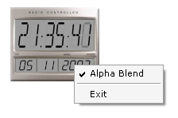



## DigiSkinClock v\.03

### Description

Another version. Made just for fun :) Features : 24h clock, day, month, year & ALPHA BLEND. looks COOOL :)
 
### More Info
 

             |
---                |---
**Submitted On**   |2003-11-05 14:45:02
**By**             |[Üllar Luik](https://github.com/Planet-Source-Code/PSCIndex/blob/master/ByAuthor/llar-luik.md)
**Level**          |Intermediate
**User Rating**    |5.0 (15 globes from 3 users)
**Compatibility**  |VB 6\.0
**Category**       |[Graphics](https://github.com/Planet-Source-Code/PSCIndex/blob/master/ByCategory/graphics__1-46.md)
**World**          |[Visual Basic](https://github.com/Planet-Source-Code/PSCIndex/blob/master/ByWorld/visual-basic.md)
**Archive File**   |[DigiSkinCl1668001152003\.zip](https://github.com/Planet-Source-Code/llar-luik-digiskinclock-v-03__1-49687/archive/master.zip)

